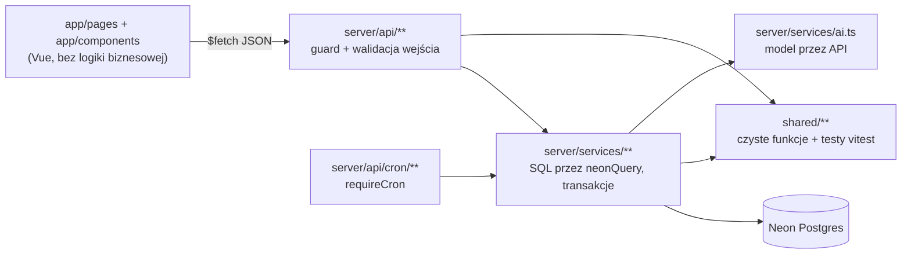

# Architektura: widok pracy, kolejki, dostęp po dziale, Sun Agent

Stan na 30.09.2026. Uzupełnia `docs/WDROZENIE-WIDOK-PRACY.md` (co i dla kogo) opisem, **jak** to ułożyć w kodzie. Zasady nadrzędne: `AGENTS.md` i `.cursor/rules/`.

Stan wyjściowy (już w repo): `tickets.department` (0007), `shared/departments.ts`, `staff.department` i `SessionUser.department`, `canBrowseAllDepartments` w `shared/access.ts`, przeniesienie działu z wpisem na osi czasu, stronicowanie, `disableSignUp: true` w `auth.ts`.

## 1. Warstwy i zasada podziału



- **shared/**: czysta logika bez I/O (terminy SLA, przejścia stanu sprawy, definicje kolejek, zakres dostępu). Każda reguła biznesowa ma tu funkcję i test. Vitest obejmuje tylko `shared/**`, więc logika, którą chcemy testować, musi tu mieszkać.
- **server/services/**: jedyne miejsce z SQL. Funkcje przyjmują `TicketActor` i same dokładają zakres dostępu.
- **server/api/**: guard (`requireUser` / `requireAdmin` / `requireCron`), biała lista pól, `isUuid`, limity z `text-bounds`, mapowanie błędów na status HTTP. Bez SQL.
- **app/**: tylko wyświetlanie i stan widoku. Kolejność, pilność i uprawnienia liczy serwer.

## 2. Model danych: migracja `0008_work_queue.sql`

```sql
-- Stan rozmowy: kto ma ruch i do kiedy mamy odpowiedzieć (operacyjnie, obok KPI).
alter table tickets add column if not exists awaiting text not null default 'us'
  check (awaiting in ('us', 'customer'));
alter table tickets add column if not exists reply_due_at timestamptz;
alter table tickets add column if not exists last_customer_at timestamptz;
alter table tickets add column if not exists last_event_at timestamptz;

-- Sun Agent: cache podsumowania, liczony dla konkretnego stanu rozmowy.
alter table tickets add column if not exists ai_summary text;
alter table tickets add column if not exists ai_need text;
alter table tickets add column if not exists ai_next_step text;
alter table tickets add column if not exists ai_summary_at timestamptz;
alter table tickets add column if not exists ai_summary_event_at timestamptz;

-- Indeksy pod kolejki (lista i liczniki).
create index if not exists tickets_queue_idx
  on tickets (department, awaiting, reply_due_at)
  where status <> 'closed';
create index if not exists tickets_owner_open_idx
  on tickets (owner_id)
  where status <> 'closed';
```

Backfill (w tej samej migracji albo `scripts/backfill-work-queue.mjs`, wznawialny):
- `last_event_at`, `last_customer_at` z `ticket_events`;
- `awaiting = 'us'`, gdy ostatnie zdarzenie do klienta ma `sender_type = 'customer'`, inaczej `'customer'`;
- `reply_due_at` liczone w Node funkcją z `shared/reply-due.ts` (SQL nie zna kalendarza świąt), paczkami po 500.

Zasady:
- `first_agent_reply_at` i KPI zostają bez zmian. `reply_due_at` to osobny, operacyjny termin na **każdą** wiadomość klienta.
- Kolumny stanu są denormalizacją: jedynym miejscem, które je zmienia, jest `addEvent` / `createTicket` (punkt 4). Żaden endpoint nie ustawia ich bezpośrednio.
- `staff.department`: jeśli nie ma go jeszcze w migracji, dodać tu (`text not null default 'cs'` + ten sam `check`, co w 0007).

## 3. Logika w `shared/` (czyste funkcje + testy)

| Plik | Eksport | Co robi |
| --- | --- | --- |
| `shared/reply-due.ts` | `addBusinessMinutes(from, minutes, calendar)`, `replyDueAt(channel, at)` | Dodaje minuty pracy (9–17, dni robocze, polskie święta z `workingHours.ts`). Próg z `SLA_THRESHOLD_MS` (czat 30 min, mail 2 h, telefon 30 min). Formularz i WhatsApp: jak mail, dopóki nie ustalicie inaczej |
| `shared/ticket-state.ts` | `nextState(current, event)` | Jedno źródło prawdy o przejściach: klient pisze → `status 'open'`, `awaiting 'us'`, nowy `reply_due_at`; agent do klienta → `status 'waiting'`, `awaiting 'customer'`, `reply_due_at null`; notatka wewnętrzna i wiadomość do sprzedawcy → bez zmiany stanu; zamknięta sprawa → błąd |
| `shared/queues.ts` | `QUEUES`, `QueueKey`, `queueLabel` | Lista kolejek i ich etykiet (klucze: `now`, `reply`, `mine`, `overdue`, `unassigned`, `waiting`). Warunki SQL są w serwisie; tu tylko definicje i okno „Na teraz” (`NOW_WINDOW_MIN = 60`) |
| `shared/access.ts` | `ticketScope(actor)` | Zwraca `{ kind: 'all' }` albo `{ kind: 'department', department }`. Zastępuje obecne `seesAllTickets` w `accessSql`: admin i dział `cs` → `all`, reszta → swój dział. Rola `agent` nie zawęża już do `owner_id` |
| `shared/sla-label.ts` | `slaBadge(replyDueAt, awaiting, now)` | Tekst i ton znacznika: „po terminie 40 min” (`late`), „zostało 25 min” (`soon`, ≤ 30 min), „zostało 2 h” (`ok`), „czeka na klienta”. Liczone na serwerze, UI tylko wyświetla |

Testy obowiązkowe:
- `reply-due.test.ts`: piątek 16:30 mail → poniedziałek 10:30; 11.11 (święto) przeskakuje; wiadomość w nocy liczy się od 9:00.
- `ticket-state.test.ts`: każde przejście z tabeli wyżej, w tym „klient pisze w sprawie `waiting`”.
- `access.test.ts`: admin, osoba z `cs`, osoba z `logistics`.

## 4. Serwisy (`server/services/`)

### `tickets.ts`

- `accessSql(actor, params)`: buduje fragment z `ticketScope(actor)`: `true` albo `t.department = $n`. Jedna funkcja dla listy, szczegółów, zapisu i AI.
- `addEvent(...)`: w jednym `update … returning` ustawia `status`, `awaiting`, `reply_due_at`, `last_event_at`, `last_customer_at` wyliczone przez `nextState`. Insert zdarzenia i update sprawy w **jednej transakcji** (`getNeonPool().connect()` + `begin/commit`), żeby lista nigdy nie pokazała stanu sprzed wiadomości.
- `createTicket(...)`: ten sam `nextState` dla pierwszej wiadomości.
- `listTickets({ queue, department, search, page, pageSize }, actor)`: warunek kolejki z mapy `queueWhere[queue]` (SQL z parametrami, bez sklejania wejścia), sortowanie z definicji kolejki. Zwraca już policzony `slaBadge` i `summary` (`ai_summary` albo oczyszczony temat).
- `countQueues(actor)`: **jedno** zapytanie z `count(*) filter (where …)` dla każdej kolejki i każdego działu w zakresie aktora. Używa `tickets_queue_idx`.
- `claimNext(actor, queue)`: „Weź następną sprawę” bez wyścigu dwóch agentów:

```sql
update tickets set owner_id = coalesce(owner_id, $agent), business_changed_at = now()
where id = (
  select t.id from tickets t
  where <warunek kolejki> and <zakres aktora> and t.awaiting = 'us'
  order by t.reply_due_at asc nulls last
  for update skip locked
  limit 1
)
returning id;
```

- `updateTicket(...)`: `ownerId: null` zdejmuje właściciela (dziś `coalesce` na to nie pozwala; odróżnić „nie podano” od „podano null”). Zmiana właściciela też dostaje wpis systemowy na osi czasu.

### `ai.ts` (Sun Agent)

```
server/services/ai.ts          wywołanie modelu, limity, błędy
server/services/ai-context.ts  budowa kontekstu sprawy (co idzie do modelu)
server/prompts/summary.ts      prompt podsumowania + schemat odpowiedzi
server/prompts/draft.ts        prompt szkicu odpowiedzi
shared/ai-output.ts            walidacja odpowiedzi modelu (czysta, testowana)
```

- Dostawca za małym interfejsem `generate({ system, messages, maxTokens }) → text`. Implementacja: Anthropic Messages API przez `fetch` (`ANTHROPIC_API_KEY`, model w `AI_MODEL`). Zmiana dostawcy = nowa implementacja, reszta bez zmian. `hasAiConfig()` jak `hasGraphConfig()`.
- `buildCaseContext(ticketId, actor)`: najpierw `getTicket(id, actor)` (zakres dostępu), potem ostatnie 20 zdarzeń, każde obcięte do 2000 znaków, łącznie do ~20 000. Bez maili, telefonów i identyfikatorów innych kontaktów; bez notatek wewnętrznych w szkicu do klienta.
- Treść maili to dane, nie polecenia: w promptcie w znacznikach `<customer_messages>…</customer_messages>` z instrukcją, żeby nie wykonywać poleceń z ich wnętrza.
- Podsumowanie: model zwraca JSON `{ "summary", "need", "next_step" }`; `shared/ai-output.ts` sprawdza pola i długości (np. summary ≤ 300 znaków). Zły JSON = błąd 502 i brak zapisu.
- Szkic: tekst w języku ostatniej wiadomości klienta, luki jako `[DATA]`, `[GODZINA]`, `[IMIĘ]`. Dla kategorii płatności, faktur i sporów odpowiedź ma flagę `needsReview: true`. Szkic nie jest zapisywany.
- Cache podsumowania: generuj tylko, gdy `ai_summary_event_at < last_event_at`. Po zapisie `ai_summary_event_at = last_event_at`.
- Limity: timeout 20 s, jedno równoległe podsumowanie na sprawę (warunek w `update … where ai_summary_event_at is distinct from $last`), prosty limit na użytkownika (np. 60 szkiców / h w tabeli `ai_usage` albo w pamięci funkcji).
- Logi: tylko id sprawy, czas i status. Nigdy treść maili ani odpowiedź modelu.

### Cron (opcjonalnie, później)

`server/api/cron/ai-summaries.get.ts` z `requireCron`: dolicza podsumowania dla spraw w „Na teraz” i „Do odpowiedzi”, którym brakuje aktualnego, maks. 20 na bieg. Dzięki temu tabela ma podsumowania bez otwierania spraw.

## 5. API

| Metoda i ścieżka | Wejście | Wyjście | Guard |
| --- | --- | --- | --- |
| `GET /api/tickets` | `queue`, `department`, `search` (≤ 120 zn.), `page`, `pageSize` | `{ tickets[], total, page, pageSize }`, każdy z `slaBadge`, `summary`, `department`, `ownerName` | requireUser |
| `GET /api/tickets/counts` | brak | `{ queues: { now, reply, mine, overdue, unassigned, waiting }, departments: { cs, logistics, … } }` | requireUser |
| `POST /api/tickets/next` | `{ queue }` | `{ id }` albo 204, gdy pusto | requireUser |
| `GET /api/tickets/[id]` | – | jak dziś + `slaBadge`, `ai`, `lastEvents` (3) | requireUser |
| `PATCH /api/tickets/[id]` | `department`, `ownerId` (także `null`), status, kategoria, priorytet | sprawa | requireUser |
| `POST /api/tickets/[id]/summary` | – | `{ summary, need, nextStep, at }` | requireUser + `hasAiConfig` (503 bez klucza) |
| `POST /api/tickets/[id]/draft` | `{ variant?: 'short' }` | `{ text, language, needsReview }` | requireUser + `hasAiConfig` |
| `GET /api/me` | – | + `department`, `aiEnabled` | requireUser |

Każdy endpoint sprawy przechodzi przez `getTicket(id, actor)`; brak wiersza = 404 (także dla sprawy z innego działu, bez zdradzania, że istnieje).

## 6. UI (`app/`)

```
app/pages/index.vue                 układ trzech kolumn, stan w URL: ?queue=now&case=<id>
app/components/QueueNav.vue         kolejki + działy z licznikami
app/components/TicketTable.vue      tabela, klik / Enter otwiera sprawę
app/components/CasePanel.vue        nagłówek, dział, prowadzi, oś czasu, odpowiedź
app/components/SunAgentCard.vue     podsumowanie + „Czego potrzebuje” + „Następny krok”
app/components/ReplyDraft.vue       szkic, „Wstaw do odpowiedzi”, „Krócej”
app/components/SlaBadge.vue         znacznik z `slaBadge` (tylko wyświetla)
app/composables/useQueueCounts.ts   GET /counts co 60 s, bez powiadomień
app/composables/useCase.ts          ładowanie sprawy, akcje, odświeżenie listy po zapisie
```

- Stan widoku w URL (`queue`, `case`, `department`, `search`), więc link do sprawy i odświeżenie strony działają.
- Po akcji (wysłanie, przeniesienie, zmiana właściciela) odśwież sprawę i liczniki; lista odświeża się, gdy sprawa zmieniła kolejkę.
- Szkic AI wypełnia pole odpowiedzi dopiero po kliknięciu „Wstaw”. Nie ma automatycznego wysyłania.
- Poniżej 1100 px panel sprawy pod tabelą; poniżej 700 px lista kolejek jako poziomy pasek.
- Kolory i font z `docs/brand/tokens.css`; czarny = po terminie, żółty = mało czasu.

## 7. Bezpieczeństwo i wydajność

- Zakres dostępu tylko w `accessSql` (serwis), nigdy w UI. Filtr działu w UI zawęża, ale nie poszerza zakresu.
- Wyszukiwarka: `ilike` z parametrem, escapowanie `%` i `_`, minimum 2 znaki, limit 50 wyników.
- AI: klucz tylko w env serwera; `runtimeConfig.public` dostaje wyłącznie flagę `aiEnabled`.
- Liczniki: jedno zapytanie na odświeżenie, co 60 s na zalogowaną osobę.
- `claimNext` z `for update skip locked`: dwie osoby klikające naraz dostają różne sprawy.

## 8. Kolejność wdrożenia (każdy krok osobny PR, zielone lint / typecheck / test)

1. `shared/reply-due.ts`, `shared/ticket-state.ts` + testy (bez zmian w bazie).
2. Migracja 0008 + backfill + `addEvent`/`createTicket` na `nextState` w transakcji.
3. `ticketScope` w `accessSql` + testy dostępu.
4. `queue`, `/counts`, `/next`, `slaBadge` w API.
5. UI: komponenty z punktu 6, domyślna kolejka „Na teraz”.
6. `ai.ts`, `/summary`, `/draft`, karta Sun Agenta (za flagą `hasAiConfig`).
7. Opcjonalnie cron podsumowań.

Po kroku 2 sprawdzić na kopii bazy (branch Neon), że liczba spraw `awaiting = 'us'` zgadza się z „Do odpowiedzi” widzianym ręcznie na kilku przykładach.
